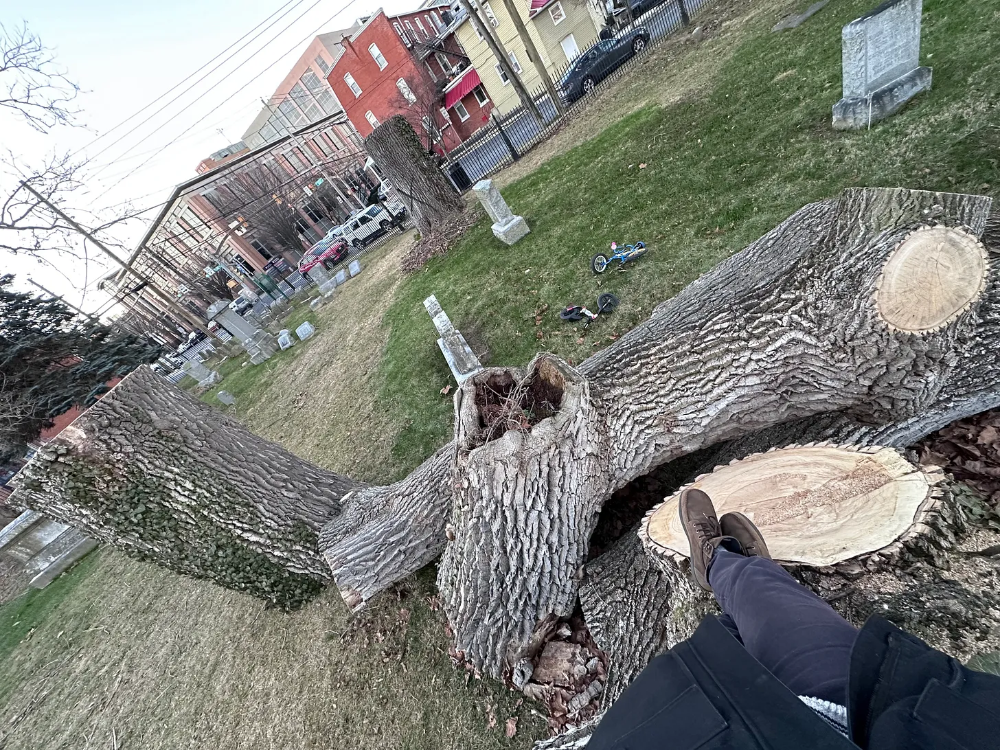
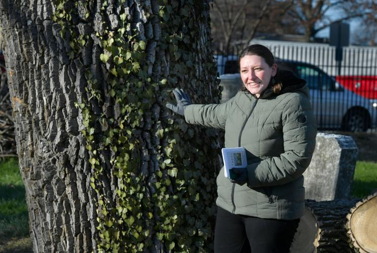
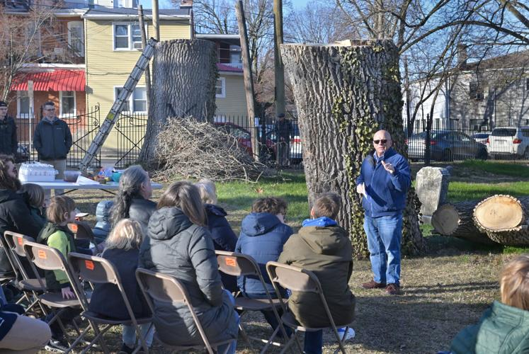
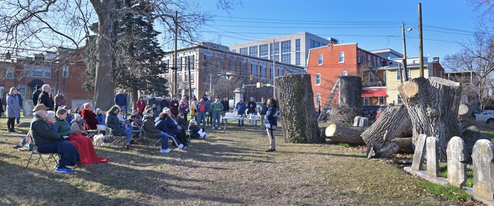
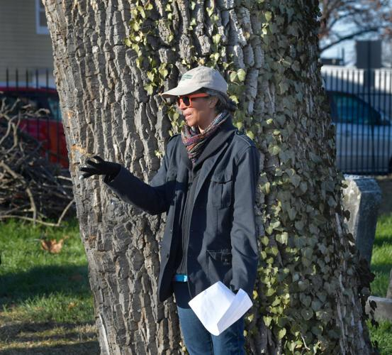
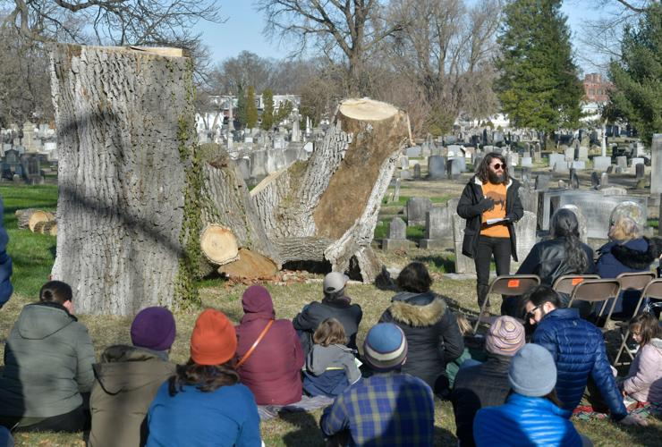
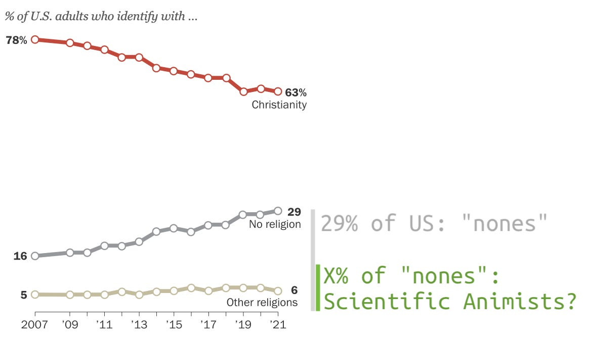

Tree Funeral
============

There’s a hole in the canopy today.

_First published in the Scientific Animism newsletter in February 2024_ [^1]

How do you think trees find the gap in the canopy? I wonder if they tell each other about it. We know that they tell each other so much—through fungal/mycelial networks between roots; through chemical signals absorbed by leaves.[^2]

Do they tell each other how to find the light?

I like to think so. Because I feel similar. Blindly sending exploratory branches this way and that. Groping, eyeless,[^3] toward a better world. I don’t know how to get there. I have some ideas of what needs to change, but no grand vision; no full solution. And whatever vision I might come up with, I know it will be partial; incomplete; a malformed, impoverished impersonation of the canopy I know we can become, if we all reach together. If you, friend, feel some warmth on your leaves, could you send me a signal? If you feel some moisture on your roots, can you tell me which way to reach?

“You and [that tree] come from a common ancestor. A billion and a half years ago, the two of you parted ways. But even now, after an immense journey in separate directions, that tree and you still share a quarter of your genes.” [^4]

When I was sitting regularly, I liked to sit with a meditation that quoted an old Zen Buddhist named Dogen.[^5] All his phrases are fanciful, perplexing, fun. “The whole universe is moistened with nectar, and the truth is ready to harvest.” And this one:

> “Ancestral teachers realize the empty sky and the great earth.”

_Ancestral teachers..._

This tree is not my ancestor (though we do, as mentioned, share some). But it is still my teacher. As I thought about what to say about this tree, what reflections to offer on its life and legacy, the tree started to teach me what Dogen meant.

I forget that “realize” has multiple meanings. Not just “to understand clearly,” but to fulfill. To make something its most actualized, most fully-realized version.

Like the ancestral teachers Dogen spoke of, this tree realized the empty sky. It made the sky into the sky's most fully-realized self; full of branches housing multitudes. It realized the great earth, making it into a whole living intelligence of roots, mycelium, and bacteria; into “a queer collective of different beings from different ‘kingdoms’ (taxonomically speaking) who have decided to engage in the ongoing intercellular conversation of living together.” [^6]

May we go and do likewise.

I organized a funeral for a tree
================================

I walk past it multiple times a week. In a big Victorian cemetery that my kids play in like a playground. My firstborn learned her letters on these grave stones, in the early pandemic before we knew playgrounds were safe.

  
_map from the event invite page, showing important nearby landmarks_

I always jump to conclusions. Don't you? You see big pieces of a tree laying around; you see some hard-hatted, chainsawed crew on cherry-pickers, hacking down a beloved elder, and you think they must be gleeful. You picture eyes full of malice. Why do they hate trees?? 

But of course they don't. Trees age. Trees die. This one hadn't leafed in years. The Ash Borer’s probably to blame.[^7] The cemetery's keepers love these trees; catalogue them; raise money to tend them. They noted this one's ailment, as did the city's streets department. And the city told the cemetery that this one had to come down. Before it brought itself down. On a building, a car, a child.

Thousands of dollars, to safely remove a big old tree, turn it into mulch, spread it on the paths. But before the grounds crew could mulch those huge limbs, snow melt and rain delayed them. Don't want to get that big machinery stuck in that mud. That's when I walked by.

  
_big pieces of the tree, laying around in Lancaster Cemetery, with the big still-in-the-ground chunk of trunk marked with an X, so the crew knew which one to cut_

And though I jumped to conclusions, imagining malice and feeling embattled, I talked myself down. Texted friends who knew the cemetery board. Texted them. Got the story, about the Ash Borer and all. Was told a new native tree would be planted (tiny, in that giant pool of sunlight). A good thing! And how familiar, how aspirational even, to die of a common disease in old age. 

But I was still sad. That tree has been keeping watch since before the civil war. Maybe since the 1840s. Before cars. Before trains. What had it seen? How had the city changed? How many mourners had it shaded? Had it registered the upticks during all those wars; the two pandemics? How many lovers had it sheltered on their walks? How many playing children?

I knew other people were sad, too. Why not be sad together? Why not commemorate the loss?

A chance to reflect on mortality. To engage with mystery. To honor a life, so alien and yet so intertwined with ours. A chance to assemble and build our human community.

So with the blessing of the cemetery board, I got to work.

What religion is a tree?

If a Buddhist dies, they have a Buddhist funeral. If a Christian, a Christian funeral. But what tradition should we draw from for a tree's funeral?

How about all of them. As many as we can find in our contacts app; as broad as our friends-of-friends network can take us.

Pastor Elisa, from the Mennonite church I attend, was the first to agree to eulogize. 

  
_Pastor Elisa Parmer from East Chestnut Street Mennonite Church. All photos courtesy of LNP/LancasterOnline, who covered the story (https://lancasteronline.com/news/local/lancaster-city-resident-organizes-funeral-for-tree-in-lancaster-cemetery/article_3567a71c-d444-11ee-84e2-bfa3d576cab6.html)_

A friend’s rabbi was the second. (Do you know, he asked me, that there’s a whole Jewish holiday dedicated to trees?[^8] I did not!) 

  
_Rabbi Jack Paskoff from Congregation Shaari Shomayim_

A friend getting his Buddhist chaplaincy was the third.

  
_Rafael Diaz, a Vajrayana Buddhist and chaplain intern_

A Cherokee friend delivering a Lakota tree prayer[^9] the fourth. 

  
_Grace Henderson, of Cherokee roots, reading a Lakota tree prayer_

And finally, me. Delivering the eulogy you read at the top. 

Call it Scientific Animism
==========================

What worldview is this?

What tradition, what well, do I draw from, when I deliver the eulogy at the start of this article?

I see it more and more.

In the writings of Richard Powers, of Robin Wall Kimmerer.

In the pages of Orion;[^10] in the poetry of Mary Oliver. In podcast interviews and art and songs.[^11] This dual-holding, this marriage of, on the one hand:

1. “Rigorous, reproducible science, which always requires the renunciation of personal wish, ego, and prior belief in favor of empirical reproduction.” [^12]

and on the other hand

2. “a common thread of species humility; an understanding that we’re not the only beings that are alive. Not the only beings that have feelings and stories. And that we live in a world, a kaleidoscope, of voices and perspectives.” [^13]

Does this worldview have a name?

I suggest we call it Scientific Animism.

For me, Christianity is likely to always be the most resonant; the deepest & richest spiritual pathway. Especially as embodied in the faith & action of the Mennonite tradition; the church I mentioned.

But I like this new perspective, too. I like its humility. Not "THIS WAY OR PERISH." But: "Here, try this lens. See how it colors things. Keep your old lens, too."

A model of the world that declares not its own preeminence, but that all models are flawed. And some are useful.[^14]

As Christianity recedes and makes room for new growth, I wonder if this is one of the things that's growing.

  
_Graph from Pew (https://www.pewresearch.org/religion/2021/12/14/about-three-in-ten-u-s-adults-are-now-religiously-unaffiliated/)_

My dream for this perspective, this movement, is that it stays open. A meeting place. A common ground. A container for events like the tree funeral.

Afterward, the other pastor of East Chestnut Street Mennonite Church, Todd Friesen, sent me this reflection:

> For me, it was one of those events that has continued to percolate deeply within, in the days that followed. It gave us a deeper vision for the sacredness of all things, including our leafed friends. And in these times of toxic religion, we also caught a vision of faith traditions working harmoniously together to treasure our natural world in unique but interconnected ways.

Interconnected, like the roots of the tree we mourned.

Interwoven, like its branches.

May we go out and be likewise. Go out, friends, and realize the sky.

And if you find a hole in the canopy—if you feel some warmth on your leaves—send me a signal.

[^1]: https://newsletter.scientificanimism.org/p/tree-funeral

[^2]: https://bookshop.org/p/books/finding-the-mother-tree-discovering-the-wisdom-of-the-forest-suzanne-simard/17806466

[^3]: https://newsletter.scientificanimism.org/p/a-time-to-be-haunted

[^4]: Richard Powers, The Overstory https://bookshop.org/p/books/the-overstory-richard-powers/17315941

[^5]: https://villagezendo.org/practice/suggested-readings/precepts/

[^6]: Laurie Palmer put it this way for Green Dreamer’s ~alchemize~ program (https://www.greendreamer.com/podcast/laurie-palmer-the-lichen-museum). Hear more of her Lessons from lichen worlds (https://www.greendreamer.com/podcast/laurie-palmer-the-lichen-museum).

[^7]: https://www.aphis.usda.gov/aphis/ourfocus/planthealth/plant-pest-and-disease-programs/pests-and-diseases/emerald-ash-borer

[^8]: https://en.wikipedia.org/wiki/Tu_BiShvat

[^9]: https://www.ya-native.com/Culture_GreatPlains/resources/TreeSpirtPrayer.html

[^10]: https://orionmagazine.org/

[^11]: https://newsletter.scientificanimism.org/p/tell-me-your-scientific-animist-reading-53e

[^12]: Richard Powers on The Ezra Klein Show, as quoted in https://newsletter.scientificanimism.org/p/scientific-animism-lets-invent-a

[^13]: Sophie Strand phrased it this way in her interview with me, https://newsletter.scientificanimism.org/p/the-sophie-strand-interview-give

[^14]: https://podcasts.apple.com/us/podcast/a-mind-bending-reality-warping-conversation-with/id1081584611
